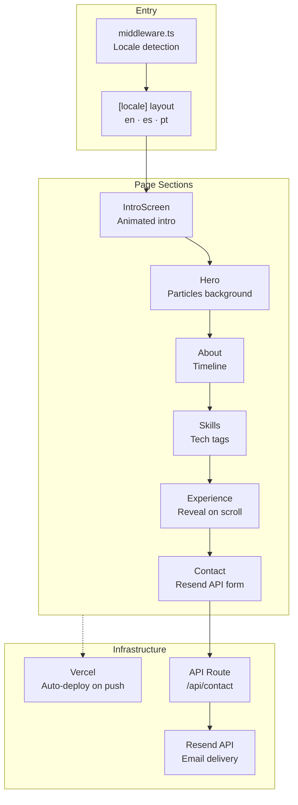
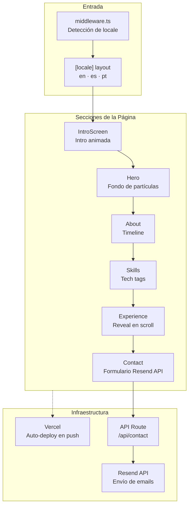

# Portfolio — Cristian Daniel Gutiérrez S.

[](https://portafolio-frontend-wheat.vercel.app)
[](https://nextjs.org)
[](https://www.typescriptlang.org)
[](https://tailwindcss.com)
[](LICENSE)
[](https://github.com/cdgutierrez6/portafolio-frontend/actions/workflows/ci.yml)

---

<details open>
<summary><h2>🇺🇸 English</h2></summary>

Multilingual personal portfolio (ES · EN · PT) showcasing 15+ years of experience as a Solutions Architect & Senior Full-Stack Engineer. Built with Next.js 14 App Router, animated with Framer Motion and auto-deployed to Vercel.

**[View Live Demo →](https://portafolio-frontend-wheat.vercel.app)**

---

### Application Flow



---

### Features

- **Multilingual** — Spanish, English and Portuguese with `next-intl`
- **Animations** — Smooth entrance transitions with `framer-motion`
- **Interactive particles** — Dynamic background with `@tsparticles`
- **Contact form** — Email delivery via `Resend` API
- **SEO optimized** — Dynamic metadata per locale
- **Performance** — 90+ on Lighthouse (Performance, Accessibility, Best Practices)
- **Tests** — Component test suite with `Vitest`

---

### Tech Stack

| Layer | Technology |
|---|---|
| Framework | Next.js 14 (App Router) |
| Language | TypeScript 5 |
| Styles | Tailwind CSS 3 |
| Animations | Framer Motion 11 |
| Particles | @tsparticles/react |
| i18n | next-intl |
| Email | Resend API |
| Testing | Vitest + Testing Library |
| Deploy | Vercel |

---

### Project Architecture

```
src/
├── app/
│   ├── [locale]/               # Internationalized routes (en · es · pt)
│   │   ├── layout.tsx
│   │   └── page.tsx
│   ├── api/
│   │   └── contact/route.ts    # Server-side email delivery via Resend
│   └── globals.css
├── components/
│   ├── portfolio/              # Page sections
│   │   ├── Hero.tsx            # Particles background + headline
│   │   ├── About.tsx           # Bio + timeline
│   │   ├── Experience.tsx      # Work history with reveal animation
│   │   ├── Skills.tsx          # Tech tags grid
│   │   ├── Contact.tsx         # Contact form
│   │   └── IntroScreen.tsx     # Animated intro splash
│   └── ui/                     # Reusable UI components
│       ├── Navbar.tsx
│       ├── Footer.tsx
│       └── ParticlesBg.tsx
├── data/
│   └── portfolio-data.ts       # Centralized content (experience, skills, projects)
├── hooks/
│   └── useReveal.ts            # Intersection Observer reveal hook
├── lib/
│   ├── types.ts
│   └── tech-descriptions.ts
└── middleware.ts               # next-intl locale routing
```

---

### Local Development

#### Prerequisites
- Node.js 18+
- npm or yarn

#### Setup

```bash
# 1. Clone the repository
git clone https://github.com/cdgutierrez6/portafolio-frontend.git
cd portafolio-frontend

# 2. Install dependencies
npm install

# 3. Configure environment variables
cp .env.local.example .env.local
# Edit .env.local with your RESEND_API_KEY

# 4. Start development server
npm run dev
```

Open [http://localhost:3000](http://localhost:3000) in your browser.

#### Environment Variables

```env
RESEND_API_KEY=your_resend_api_key_here
```

---

### Running Tests

```bash
# Run all tests (single pass)
npm run test

# Watch mode — re-runs on every file save (recommended during development)
npm run test -- --watch

# With coverage report
npm run test -- --coverage

# Run a specific test file
npm run test -- Hero.test.tsx
npm run test -- Contact.test.tsx
```

| Test file | What it covers |
|---|---|
| `Hero.test.tsx` | Renders headline, subtitle and CTA button correctly |
| `Contact.test.tsx` | Form validation, submit state, error handling |
| `useReveal.test.ts` | IntersectionObserver hook triggers correct class toggle |
| `middleware.test.ts` | Locale detection and redirect logic |

---

### Available Scripts

```bash
npm run dev      # Development server with HMR
npm run build    # Production build
npm run start    # Production server
npm run lint     # ESLint
npm run test     # Vitest test suite
```

---

### Deploy

The project is deployed on **Vercel** with automatic CI/CD from the `master` branch. Every `git push` triggers a new deployment.

[](https://vercel.com/new/clone?repository-url=https://github.com/cdgutierrez6/portafolio-frontend)

---

### Contact

**Cristian Daniel Gutiérrez S.**

- Email: [cdgutierrez6@gmail.com](mailto:cdgutierrez6@gmail.com)
- LinkedIn: [cristian-daniel-gutiérrez-segura](https://www.linkedin.com/in/cristian-daniel-guti%C3%A9rrez-segura)
- Portfolio: [portafolio-frontend-wheat.vercel.app](https://portafolio-frontend-wheat.vercel.app)

---

### License

MIT License — see [LICENSE](LICENSE) for details.

</details>

---

<details>
<summary><h2>🇨🇴 Español</h2></summary>

Portfolio personal multilingüe (ES · EN · PT) que presenta más de 15 años de experiencia como Solutions Architect & Senior Full-Stack Engineer. Construido con Next.js 14 App Router, animado con Framer Motion y desplegado automáticamente en Vercel.

**[Ver Demo en Vivo →](https://portafolio-frontend-wheat.vercel.app)**

---

### Flujo de la Aplicación



---

### Características

- **Multilingüe** — Español, Inglés y Portugués con `next-intl`
- **Animaciones** — Transiciones de entrada fluidas con `framer-motion`
- **Partículas interactivas** — Fondo dinámico con `@tsparticles`
- **Formulario de contacto** — Envío de emails vía `Resend` API
- **SEO optimizado** — Metadata dinámica por locale
- **Rendimiento** — 90+ en Lighthouse (Performance, Accessibility, Best Practices)
- **Tests** — Suite de tests de componentes con `Vitest`

---

### Stack Técnico

| Capa | Tecnología |
|---|---|
| Framework | Next.js 14 (App Router) |
| Lenguaje | TypeScript 5 |
| Estilos | Tailwind CSS 3 |
| Animaciones | Framer Motion 11 |
| Partículas | @tsparticles/react |
| i18n | next-intl |
| Email | Resend API |
| Testing | Vitest + Testing Library |
| Deploy | Vercel |

---

### Arquitectura del Proyecto

```
src/
├── app/
│   ├── [locale]/               # Rutas internacionalizadas (en · es · pt)
│   │   ├── layout.tsx
│   │   └── page.tsx
│   ├── api/
│   │   └── contact/route.ts    # Envío de email server-side vía Resend
│   └── globals.css
├── components/
│   ├── portfolio/              # Secciones de la página
│   │   ├── Hero.tsx            # Fondo de partículas + titular
│   │   ├── About.tsx           # Bio + timeline
│   │   ├── Experience.tsx      # Historial laboral con animación reveal
│   │   ├── Skills.tsx          # Grid de tech tags
│   │   ├── Contact.tsx         # Formulario de contacto
│   │   └── IntroScreen.tsx     # Splash de intro animado
│   └── ui/                     # Componentes UI reutilizables
│       ├── Navbar.tsx
│       ├── Footer.tsx
│       └── ParticlesBg.tsx
├── data/
│   └── portfolio-data.ts       # Contenido centralizado (experiencia, skills, proyectos)
├── hooks/
│   └── useReveal.ts            # Hook Intersection Observer para reveal
├── lib/
│   ├── types.ts
│   └── tech-descriptions.ts
└── middleware.ts               # Routing de locales con next-intl
```

---

### Instalación y Desarrollo Local

#### Prerrequisitos
- Node.js 18+
- npm o yarn

#### Pasos

```bash
# 1. Clonar el repositorio
git clone https://github.com/cdgutierrez6/portafolio-frontend.git
cd portafolio-frontend

# 2. Instalar dependencias
npm install

# 3. Configurar variables de entorno
cp .env.local.example .env.local
# Editar .env.local con tu RESEND_API_KEY

# 4. Correr en modo desarrollo
npm run dev
```

Abre [http://localhost:3000](http://localhost:3000) en el navegador.

#### Variables de Entorno

```env
RESEND_API_KEY=your_resend_api_key_here
```

---

### Correr Tests

```bash
# Correr todos los tests (una sola pasada)
npm run test

# Watch mode — re-corre en cada guardado (recomendado en desarrollo)
npm run test -- --watch

# Con reporte de cobertura
npm run test -- --coverage

# Archivo específico
npm run test -- Hero.test.tsx
npm run test -- Contact.test.tsx
```

| Archivo de test | Qué cubre |
|---|---|
| `Hero.test.tsx` | Renderiza titular, subtítulo y botón CTA correctamente |
| `Contact.test.tsx` | Validación de formulario, estado de envío, manejo de errores |
| `useReveal.test.ts` | Hook IntersectionObserver dispara toggle de clase correcto |
| `middleware.test.ts` | Lógica de detección de locale y redirección |

---

### Scripts Disponibles

```bash
npm run dev      # Servidor de desarrollo con HMR
npm run build    # Build de producción
npm run start    # Servidor de producción
npm run lint     # ESLint
npm run test     # Suite de tests Vitest
```

---

### Deploy

El proyecto está desplegado en **Vercel** con CI/CD automático desde la rama `master`. Cada `git push` dispara un nuevo deploy.

[](https://vercel.com/new/clone?repository-url=https://github.com/cdgutierrez6/portafolio-frontend)

---

### Contacto

**Cristian Daniel Gutiérrez S.**

- Email: [cdgutierrez6@gmail.com](mailto:cdgutierrez6@gmail.com)
- LinkedIn: [cristian-daniel-gutiérrez-segura](https://www.linkedin.com/in/cristian-daniel-guti%C3%A9rrez-segura)
- Portfolio: [portafolio-frontend-wheat.vercel.app](https://portafolio-frontend-wheat.vercel.app)

---

### Licencia

MIT License — ver [LICENSE](LICENSE) para detalles.

</details>
