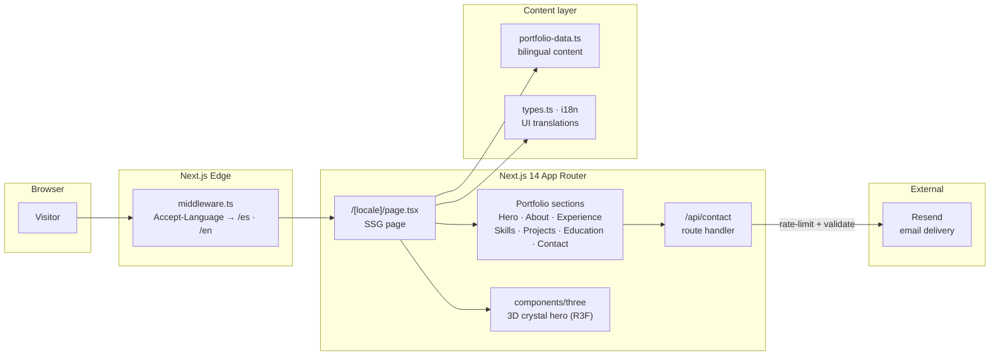
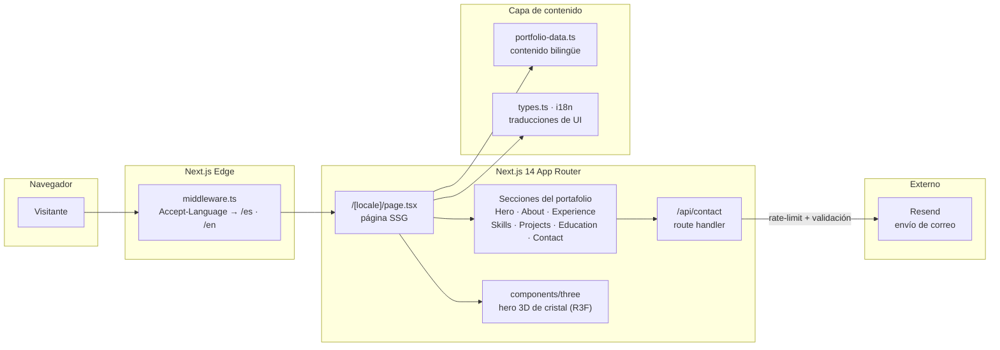

# Portafolio — Cristian Daniel Gutiérrez S.


> **Bilingual developer portfolio** — a fully server-rendered (SSG), locale-routed (`/es` · `/en`) personal site with a **cinematic 3D hero** (react-three-fiber), scroll-driven motion, and a hardened Resend-backed contact form.

**Live:** https://portafolio-frontend-wheat.vercel.app

---

<details open>
<summary><h2>🇺🇸 English</h2></summary>

### Architecture


```mermaid
flowchart LR
    subgraph Client["Browser"]
        V[Visitor]
    end

    subgraph Edge["Next.js Edge"]
        MW["middleware.ts<br/>Accept-Language → /es · /en"]
    end

    subgraph App["Next.js 14 App Router"]
        LP["/[locale]/page.tsx<br/>SSG page"]
        SEC["Portfolio sections<br/>Hero · About · Experience<br/>Skills · Projects · Education · Contact"]
        R3F["components/three<br/>3D crystal hero (R3F)"]
        API["/api/contact<br/>route handler"]
    end

    subgraph Data["Content layer"]
        PD["portfolio-data.ts<br/>bilingual content"]
        I18N["types.ts · i18n<br/>UI translations"]
    end

    subgraph Ext["External"]
        RS["Resend<br/>email delivery"]
    end

    V --> MW --> LP
    LP --> SEC
    LP --> R3F
    LP --> PD
    LP --> I18N
    SEC --> API
    API -->|rate-limit + validate| RS
```

---

### Features

- **Bilingual by route** — locale-segmented App Router (`/es`, `/en`); `middleware.ts` reads `Accept-Language` at the root and redirects to the visitor's preferred language.
- **Cinematic 3D hero** — an art-directed crystal built with **three.js / react-three-fiber / drei + postprocessing**, driven by scroll via **GSAP + Lenis**. Performance-gated: WebGL only mounts after the intro and is disabled on `prefers-reduced-motion` and low-end devices (low `deviceMemory` / `hardwareConcurrency`), with capped `dpr` and a lighter mobile path.
- **Single source of content** — all experience, skills, education, courses and projects live in `src/data/portfolio-data.ts`, each field carrying `Es`/`En` variants selected at render time.
- **Hardened contact API** — `/api/contact` applies per-IP rate limiting, field-length caps, email validation and HTML escaping before delivering through Resend; if no transport is configured it returns `503` and the UI **falls back to a pre-filled `mailto:` draft** — the message is never silently dropped.
- **Security headers** — CSP, HSTS, `X-Frame-Options`, `X-Content-Type-Options`, `Referrer-Policy` and `Permissions-Policy` set globally in `next.config.mjs`.
- **SEO ready** — dynamic `sitemap.ts`, `Person` JSON-LD, and a dynamic Open Graph image generated with `next/og` (`opengraph-image.tsx`).

---

### Quick Start

```bash
git clone https://github.com/cdgutierrez6/portafolio-frontend.git
cd portafolio-frontend

npm install
cp .env.local.example .env.local   # fill in the values below

npm run dev        # http://localhost:3000 → redirects to /es or /en
npm run build      # production build (SSG)
npm run start      # serve the production build
npm run lint       # ESLint
```

---

### Project Structure

```
portafolio-frontend/
├── src/
│   ├── app/
│   │   ├── [locale]/          # es / en routes (SSG)
│   │   │   ├── layout.tsx
│   │   │   ├── opengraph-image.tsx   # dynamic OG image (next/og)
│   │   │   └── page.tsx       # composes all portfolio sections
│   │   ├── api/contact/       # contact route handler (Resend)
│   │   ├── sitemap.ts         # dynamic sitemap
│   │   └── globals.css
│   ├── components/
│   │   ├── portfolio/         # Hero, About, Experience, Skills,
│   │   │                      #   Projects, Education, Contact, Preloader…
│   │   ├── three/             # 3D crystal hero (Scene3DBackground) — R3F/drei
│   │   └── ui/                # Navbar, Footer
│   ├── data/
│   │   └── portfolio-data.ts  # all bilingual portfolio content
│   ├── hooks/
│   │   └── useReveal.ts       # scroll-reveal hook (IntersectionObserver)
│   ├── lib/
│   │   ├── types.ts           # TS types + i18n UI translations
│   │   ├── contact-validators.ts
│   │   └── tech-descriptions.ts
│   └── middleware.ts          # root locale redirect
├── public/                    # static assets (models, hdri, media)
├── next.config.mjs            # security headers + image domains
└── tailwind.config.ts
```

---

### API Reference

| Method | Route | Description |
|--------|-------|-------------|
| `POST` | `/api/contact` | Sends a contact message. Body: `senderName`, `senderEmail`, `subject`, `message`. Rate-limited per IP; validates field lengths and email format. Returns `429` when the limit is exceeded, `400` on invalid input. Delivers via Resend when `RESEND_API_KEY` is set; otherwise returns `503` and the UI falls back to a pre-filled `mailto:` draft. |

---

### Environment Variables

| Variable | Description | Required |
|----------|-------------|----------|
| `NEXT_PUBLIC_BASE_URL` | Public base URL of the site, used for SEO metadata and the sitemap. | Yes |
| `RESEND_API_KEY` | Resend API key for contact-form email delivery. Without it, the form falls back to a `mailto:` draft. | No |
| `CONTACT_EMAIL` | Destination address for contact messages. Must match a verified address on your Resend account. | No (defaults to owner email) |

---

### Tech Stack

- **Next.js 14** (App Router, SSG) — framework, routing, route handlers.
- **React 18 + TypeScript** — UI and type safety.
- **three.js · react-three-fiber · drei · @react-three/postprocessing** — the cinematic 3D crystal hero.
- **GSAP + Lenis** — scroll-driven animation and smooth scrolling.
- **Tailwind CSS** — utility-first styling.
- **Resend** — transactional email for the contact form.
- **react-hot-toast** — form feedback notifications.
- **Vercel** — hosting and CI deploy on push to `master`.

---

### Author

**Cristian Daniel Gutiérrez S.** — Solutions Architect | Senior Full-Stack Engineer · 13+ years

[LinkedIn](https://www.linkedin.com/in/cristian-daniel-guti%C3%A9rrez-segura) · [Portfolio](https://portafolio-frontend-wheat.vercel.app) · [cdgutierrez6@gmail.com](mailto:cdgutierrez6@gmail.com)

</details>

---

<details>
<summary><h2>🇨🇴 Español</h2></summary>

### Arquitectura


```mermaid
flowchart LR
    subgraph Client["Navegador"]
        V[Visitante]
    end

    subgraph Edge["Next.js Edge"]
        MW["middleware.ts<br/>Accept-Language → /es · /en"]
    end

    subgraph App["Next.js 14 App Router"]
        LP["/[locale]/page.tsx<br/>página SSG"]
        SEC["Secciones del portafolio<br/>Hero · About · Experience<br/>Skills · Projects · Education · Contact"]
        R3F["components/three<br/>hero 3D de cristal (R3F)"]
        API["/api/contact<br/>route handler"]
    end

    subgraph Data["Capa de contenido"]
        PD["portfolio-data.ts<br/>contenido bilingüe"]
        I18N["types.ts · i18n<br/>traducciones de UI"]
    end

    subgraph Ext["Externo"]
        RS["Resend<br/>envío de correo"]
    end

    V --> MW --> LP
    LP --> SEC
    LP --> R3F
    LP --> PD
    LP --> I18N
    SEC --> API
    API -->|rate-limit + validación| RS
```

---

### Características

- **Bilingüe por ruta** — App Router segmentado por idioma (`/es`, `/en`); `middleware.ts` lee `Accept-Language` en la raíz y redirige al idioma preferido del visitante.
- **Hero 3D cinematográfico** — un cristal art-directed hecho con **three.js / react-three-fiber / drei + postprocessing**, animado por scroll con **GSAP + Lenis**. Optimizado: el WebGL solo se monta tras la intro y se apaga en `prefers-reduced-motion` y en dispositivos de gama baja (poca `deviceMemory` / `hardwareConcurrency`), con `dpr` acotado y una ruta más liviana en móvil.
- **Contenido en una sola fuente** — toda la experiencia, skills, educación, cursos y proyectos viven en `src/data/portfolio-data.ts`, con cada campo en variantes `Es`/`En` seleccionadas al renderizar.
- **API de contacto endurecida** — `/api/contact` aplica rate limiting por IP, límites de longitud, validación de email y escape de HTML antes de entregar vía Resend; si no hay transporte configurado devuelve `503` y la UI **cae a un borrador `mailto:` pre-rellenado** — el mensaje nunca se pierde en silencio.
- **Cabeceras de seguridad** — CSP, HSTS, `X-Frame-Options`, `X-Content-Type-Options`, `Referrer-Policy` y `Permissions-Policy` definidas globalmente en `next.config.mjs`.
- **Listo para SEO** — `sitemap.ts` dinámico, JSON-LD `Person`, y una imagen Open Graph dinámica generada con `next/og` (`opengraph-image.tsx`).

---

### Inicio Rápido

```bash
git clone https://github.com/cdgutierrez6/portafolio-frontend.git
cd portafolio-frontend

npm install
cp .env.local.example .env.local   # completa los valores de abajo

npm run dev        # http://localhost:3000 → redirige a /es o /en
npm run build      # build de producción (SSG)
npm run start      # sirve el build de producción
npm run lint       # ESLint
```

---

### Estructura del Proyecto

```
portafolio-frontend/
├── src/
│   ├── app/
│   │   ├── [locale]/          # rutas es / en (SSG)
│   │   │   ├── layout.tsx
│   │   │   ├── opengraph-image.tsx   # imagen OG dinámica (next/og)
│   │   │   └── page.tsx       # compone todas las secciones del portafolio
│   │   ├── api/contact/       # route handler de contacto (Resend)
│   │   ├── sitemap.ts         # sitemap dinámico
│   │   └── globals.css
│   ├── components/
│   │   ├── portfolio/         # Hero, About, Experience, Skills,
│   │   │                      #   Projects, Education, Contact, Preloader…
│   │   ├── three/             # hero 3D de cristal (Scene3DBackground) — R3F/drei
│   │   └── ui/                # Navbar, Footer
│   ├── data/
│   │   └── portfolio-data.ts  # todo el contenido bilingüe del portafolio
│   ├── hooks/
│   │   └── useReveal.ts       # hook de scroll-reveal (IntersectionObserver)
│   ├── lib/
│   │   ├── types.ts           # tipos TS + traducciones de UI (i18n)
│   │   ├── contact-validators.ts
│   │   └── tech-descriptions.ts
│   └── middleware.ts          # redirección de idioma en la raíz
├── public/                    # assets estáticos (models, hdri, media)
├── next.config.mjs            # cabeceras de seguridad + dominios de imágenes
└── tailwind.config.ts
```

---

### Referencia de API

| Método | Ruta | Descripción |
|--------|------|-------------|
| `POST` | `/api/contact` | Envía un mensaje de contacto. Body: `senderName`, `senderEmail`, `subject`, `message`. Limitado por IP; valida longitudes de campo y formato de email. Devuelve `429` al superar el límite y `400` ante entrada inválida. Entrega vía Resend cuando `RESEND_API_KEY` está configurada; de lo contrario devuelve `503` y la UI cae a un borrador `mailto:` pre-rellenado. |

---

### Variables de Entorno

| Variable | Descripción | Requerida |
|----------|-------------|-----------|
| `NEXT_PUBLIC_BASE_URL` | URL base pública del sitio, usada para metadata SEO y el sitemap. | Sí |
| `RESEND_API_KEY` | API key de Resend para el envío del formulario de contacto. Sin ella, el formulario cae a un borrador `mailto:`. | No |
| `CONTACT_EMAIL` | Dirección destino de los mensajes de contacto. Debe coincidir con un email verificado en tu cuenta Resend. | No (usa el email del autor por defecto) |

---

### Tecnologías

- **Next.js 14** (App Router, SSG) — framework, ruteo y route handlers.
- **React 18 + TypeScript** — UI y seguridad de tipos.
- **three.js · react-three-fiber · drei · @react-three/postprocessing** — el hero 3D de cristal cinematográfico.
- **GSAP + Lenis** — animación por scroll y scroll suave.
- **Tailwind CSS** — estilos utility-first.
- **Resend** — correo transaccional para el formulario de contacto.
- **react-hot-toast** — notificaciones de feedback del formulario.
- **Vercel** — hosting y deploy en CI al hacer push a `master`.

---

### Autor

**Cristian Daniel Gutiérrez S.** — Arquitecto de Soluciones | Ingeniero Full-Stack Senior · 13+ años

[LinkedIn](https://www.linkedin.com/in/cristian-daniel-guti%C3%A9rrez-segura) · [Portafolio](https://portafolio-frontend-wheat.vercel.app) · [cdgutierrez6@gmail.com](mailto:cdgutierrez6@gmail.com)

</details>
